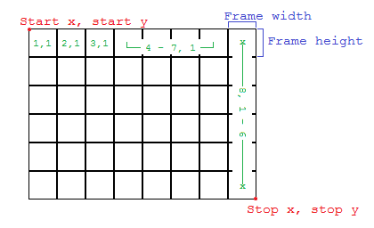

Walt
====

An animation library for LÖVE.

# Table of Contents

- [Usage](#usage)
- [Name](#name)
- [Functions](#functions)
    - [animator.merge](#animatormerge)
    - [animator.newAnimation](#animatornewanimation)
        - [anim:draw](#animdraw)
        - [anim:getActive](#animgetactive)
        - [anim:getCurrentFrame](#animgetcurrentframe)
        - [anim:getDimensions](#animgetdimensions)
        - [anim:getHeight](#animgetheight)
        - [anim:getLooping](#animgetlooping)
        - [anim:getOnAnimationChange](#animgetonanimationchange)
        - [anim:getOnLoop](#animgetonloop)
        - [anim:getPauseAtEnd](#animgetpauseatend)
        - [anim:getPaused](#animgetpaused)
        - [anim:getWidth](#animgetwidth)
        - [anim:pause](#animpause)
        - [anim:pauseAtEnd](#animpauseatend)
        - [anim:restart](#animrestart)
        - [anim:resume](#animresume)
        - [anim:setActive](#animsetactive)
        - [anim:setCurrentFrame](#animsetcurrentframe)
        - [anim:setLooping](#animsetlooping)
        - [anim:setOnAnimationChange](#animsetonanimationchange)
        - [anim:setOnLoop](#animsetonloop)
        - [anim:setPauseAtEnd](#animsetpauseatend)
        - [anim:setPaused](#animsetpaused)
        - [anim:togglePause](#animtogglepause)
        - [anim:toggleActive](#animtoggleactive)
        - [anim:toggleLooping](#animtogglelooping)
        - [anim:togglePauseAtEnd](#animtogglepauseatend)
        - [anim:update](#animupdate)
        - [Aliases](#aliases)
    - [animator.newGrid](#animatornewgrid)
        - [grid:getFrames](#gridgetframes)
- [Examples](#examples)

## Usage

```Lua
local animator = require 'path.to.walt'

function love.load()
    local image = love.graphics.newImage( 'Path/to/image.png' )
    anim = animator.newAnimation( { image }, 1 )
end

function love.update( dt )
    anim:update( dt )
end

function love.draw()
    anim:draw()
end
```
And that's it!

## Name

- Walt is named for famous animator Walt Disney.

## Functions

### animator.merge

- Combine several tables into one compact table.
- Synopsis:
    - `frames = animator.merge( ... )`
- Arguments: 
	- `...`: Tables. A list of images and quads in the order of the animation. 
- Returns:
	- `frames`: Table. A flattened list of the quads and images. 
- Notes: 
    - Works well in combination with [`animator.newAnimation`](#animatornewanimation).

### animator.newAnimation

- Creates a new animation object. 
- Synopsis:
    - `anim = animator.newAnimation( frames, duration, [quadImage] )`
    - `anim = animator.newAnimation( frames, durations, [quadImage] )`
- Arguments: 
    - `frames`: Table. A flat table of images and quads in the order that they will be played.
	- `duration`: Number. The amount of time each animation will be played.
    - `durations`: Table. There are several _"flavors"_ to this table. Each must have the same number of entries as `frames`. You can combine these in any way. See below table for more.
	- `quadImage`: Image. The image that the quads for the animation will be using. Not needed if you aren't using any quads. 

| Flavor    | Description                                                                                                               | Example               |
| ----------|---------------------------------------------------------------------------------------------------------------------------|-----------------------|
| __Flat__  | A numbered list, representing the corresponding frame.                                                                    | `{ .1, .2, .1, .5 }`  |
| __List__  | A table key, listing the frame numbers, in the style of `lower - larger`. Can have 0-unlimited spaces between the `-`.    | `{ ['1 - 5'] = 1 }`   |
| __Key__   | Frame numbers are seperated by `,`. Can have 0-unlimited spaces after the `,`.                                            | `{ ['1, 3, 5'] = 1 }` |

- Returns:
	- `anim`: Table. Animation object that can be used. For more, see the `anim:` sub-functions.
- Notes: 
    - The quads should all be from the same image. 
    - After all of the `Key`s and `List`s are inserted, the unassigned keys are done in the order of the `flat` entries.
        - `{ ['1 - 3'] = .5, ['6 - 10'] = 1, .2, .3, .4 }` = `{ .5, .5, .5, .2, .3, 1, 1, 1, 1, 1, .4 }`

#### anim:draw

- Draw the animation. 
- Synopsis:
    - `anim:draw()`
- Arguments:
- Returns:
    - Nothing.
- Notes: 
    - You have to call `[anim:update](#animupdate)` as well.

#### anim:getActive

- Returns if the animation is currently playing.
- Synopsis:
    - `active = anim:getActive()`
- Arguments:
    - `anim`: Table. An animation object returned from [`animator.newAnimation`](#animatornewanimation).
- Returns:
	- `active`: Boolean. Whether the animation is playing or not. 

#### anim:getCurrentFrame

- Gets the current frame number.
- Synopsis:
    - `frame = anim:getCurrentFrame()`
- Arguments:
    - `anim`: Table. An animation object returned from [`animator.newAnimation`](#animatornewanimation).
- Returns:
	- `frame`: Number. The number frame that the animation is on.

#### anim:getDimensions

- Gets the width and height of the current frame of the animation.
- Synopsis: 
    - `width, height = anim:getDimensions()`
- Arguments:
    - `anim`: Table. An animation object returned from [`animator.newAnimation`](#animatornewanimation).
- Returns:
	- `width`: Number. The width of the current frame. 
	- `height`: Number. THe height of the current frame.

#### anim:getHeight

- Gets the height of the current frame of the animation. 
- Synopsis:
    - `height = anim:getHeight()`
- Arguments:
    - `anim`: Table. An animation object returned from [`animator.newAnimation`](#animatornewanimation).
- Returns:
	- `height`: Number. The height of the current frame.

#### anim:getLooping

- Gets whether the animation is a looping animation or not. 
- Synopsis:
    - `isLooping = anim:getLooping()`
- Arguments:
    - `anim`: Table. An animation object returned from [`animator.newAnimation`](#animatornewanimation).
- Returns:
	- `isLooping`: Boolean. Whether the animation is looping or not. 

#### anim:getOnAnimationChange

- Gets the function called on frame-change.
- Synopsis:
    - `func = anim:getOnAnimationChange()`
- Arguments:
    - `anim`: Table. An animation object returned from [`animator.newAnimation`](#animatornewanimation).
- Returns:
	- `func`: Function. The function called on frame-change.

#### anim:getOnLoop

- Gets the function called on-loop. 
- Synopsis:
    - `func = anim:getOnLoop()`
- Arguments:
    - `anim`: Table. An animation object returned from [`animator.newAnimation`](#animatornewanimation).
- Returns:
	- `func`: Function. The function called on-loop. 

#### anim:getPauseAtEnd

- Gets whether the animation should pause on the last frame. 
- Synopsis:
    - `shouldPause = anim:getPauseAtEnd()`
- Arguments:
    - `anim`: Table. An animation object returned from [`animator.newAnimation`](#animatornewanimation).
- Returns:
	- `shouldPause`: Boolean. Whether the animation will pause at the end or not. 

#### anim:getPaused

- Gets whether the animation is paused or not. 
- Synopsis:
    - `isPaused = anim:getPaused()`
- Arguments:
    - `anim`: Table. An animation object returned from [`animator.newAnimation`](#animatornewanimation).
- Returns:
	- `isPaused`: Boolean. Whether the animation is paused or not.

#### anim:getWidth

- Gets the width of the current frame of the animation. 
- Synopsis:
    - `width = anim:getWidth()`
- Arguments:
    - `anim`: Table. An animation object returned from [`animator.newAnimation`](#animatornewanimation).
- Returns:
	- `width`: Number. The width of the frame. 

#### anim:pause

- Pauses the animation. 
- Synopsis:
    - `anim:pause()`
- Arguments:
    - `anim`: Table. An animation object returned from [`animator.newAnimation`](#animatornewanimation).
- Returns:
    - Nothing. 

#### anim:pauseAtEnd

- Sets the function to pause after the last frame has played. 
- Synopsis:
    - `anim:pauseAtEnd()`
- Arguments:
    - `anim`: Table. An animation object returned from [`animator.newAnimation`](#animatornewanimation).
- Returns:
    - Nothing. 

#### anim:restart

- Resets the animation to the first frame.
- Synopsis:
    - `anim:restart()`
- Arguments:
    - `anim`: Table. An animation object returned from [`animator.newAnimation`](#animatornewanimation).
- Returns:
    - Nothing. 

#### anim:resume

- Resumes the animation from a pause. 
- Synopsis:
    - `anim:resume()`
- Arguments:
    - `anim`: Table. An animation object returned from [`animator.newAnimation`](#animatornewanimation).
- Returns:
    - Nothing. 

#### anim:setActive

- Stops or resumes the animation. 
- Synopsis:
    - `anim:setActive( active )`
- Arguments:
    - `anim`: Table. An animation object returned from [`animator.newAnimation`](#animatornewanimation).
    - `active`: Boolean. Whether the animation should be playing (`true`) or not (`false`).
- Returns:
    - Nothing. 

#### anim:setCurrentFrame

- Sets the current frame of the animation. 
- Synopsis:
    - `anim:setCurrentFrame( frame )`
- Arguments: 
    - `anim`: Table. An animation object returned from [`animator.newAnimation`](#animatornewanimation).
	- `frame`: Number. The frame to be set. 
- Returns:
    - Nothing. 

#### anim:setLooping

- Sets whether the animation should loop at the end or not. 
- Synopsis:
    - `anim:setLooping( loop )`
- Arguments:
	- `anim`: Table. An animation object returned from [`animator.newAnimation`](#animatornewanimation). 
	- `loop`: Boolean. Whether the animation should loop at the end or not. 
- Returns:
    - Nothing. 

#### anim:setOnAnimationChange

- Sets the function executed on animation change. 
- Synopsis:
    - `anim:setOnAnimationChange( func )`
- Arguments:
	- `anim`: Table. An animation object returned from [`animator.newAnimation`](#animatornewanimation). 
	- `func`: Function. The function to be called on each animation increment. 
- Returns: 
	- Nothing

#### anim:setOnLoop

- Sets the function executed on loop. 
- Synopsis:
    - `anim:setOnLoop( func )`
- Arguments:
	- `anim`: Table. An animation object returned from [`animator.newAnimation`](#animatornewanimation). 
	- `func`: Function. The function to be called on each loop. 
- Returns:
	- Nothing.

#### anim:setPauseAtEnd

- Sets the animation to pause after displaying the final frame. 
- Synopsis:
    - `anim:setPauseAtEnd( shouldPause )`
- Arguments:
	- `anim`: Table. An animation object returned from [`animator.newAnimation`](#animatornewanimation). 
    - `shouldPause`: Boolean. Whether or not the function should pause after displaying the final frame. 
- Returns:
	- Nothing.

#### anim:setPaused

- Sets if the animation is paused or not. 
- Synopsis:
    - `anim:setPaused( isPaused )`
- Arguments:
	- `anim`: Table. An animation object returned from [`animator.newAnimation`](#animatornewanimation). 
	- `isPaused`: Boolean. Whether the animation should be paused or not.
- Returns:
	- Nothing.

#### anim:togglePause

- Toggles the pause of the animation. 
- Synopsis:
    - `anim:togglePause()`
- Arguments:
	- `anim`: Table. An animation object returned from [`animator.newAnimation`](#animatornewanimation). 
- Returns:
	- Nothing.

#### anim:toggleActive

- Toggles whether the animation is active or not. 
- Synopsis:
    - `anim:toggleActive()`
- Arguments:
	- `anim`: Table. An animation object returned from [`animator.newAnimation`](#animatornewanimation). 
- Returns:
	- Nothing.

#### anim:toggleLooping

- Toggles whether the animation is looping or not. 
- Synopsis:
    - `anim:toggleLooping()`
- Arguments:
	- `anim`: Table. An animation object returned from [`animator.newAnimation`](#animatornewanimation). 
- Returns:
	- Nothing.

#### anim:togglePauseAtEnd

- Toggles whether the animation pauses after playing the last frame. 
- Synopsis:
    - `anim:togglePauseAtEnd()`
- Arguments:
	- `anim`: Table. An animation object returned from [`animator.newAnimation`](#animatornewanimation). 
- Returns:
	- Nothing.

#### anim:update

- Update the animation. 
- Synopsis:
    - `anim:update( dt )`
- Arguments:
	- `anim`: Table. An animation object returned from [`animator.newAnimation`](#animatornewanimation). 
	- `dt`: Number. The time between each update-frame. 
- Returns:
	- Nothing.

### animator.newGrid

- Creates a new grid to make animation easier. 
- Synopsis:
    - `grid = animator.newGrid( frameWidth, frameHeight, image, [startX, startY, stopX, stopY] )`
- Arguments: 
	- `frameWidth`: Number. The width each quad will be. 
	- `frameHeight`: Number. The height each frame will be. 
	- `image`: Image. The image that will be used. 
	- `startX`: Number. The x position to start creating the grid. Defaults as 0. 
	- `startY`: Number. The y position to start creating the grid. Defaults as 0. 
	- `stopX`: Number. The x position to stop creating the grid. Defauls as the image's width. 
	- `stopY`: Number. The y position to stop creating the grid. Defaults as the image's height. 
- Returns:
	- `grid`: Table. A table of quads. 

#### grid:getFrames

- Returns the quads in the specified order you create it. 
- Synopsis:
    - `frames = grid:getFrames()`
- Arguments:
	- `grid`: Table. A grid object retured by [`animator:newGrid`](#animatornewgrid). See the picture below to get a better idea of how they work.
- Returns:
	- `frames`: Table. A table containing the quads created from the grid. 

- Each pair of numbers is a pair of x and y coordinates, referring to the grid. 
    - Use plain numbers to refer to single simple x and y coordinates. 
    - Use a string with numbers seperated by a hyphen (`-`) to represent _"through"_. 
    - In a pairs, both arguments can't be strings.
- So you would make a grid like this (assuming the image is called `'grid.png'`):



```Lua
local image = love.graphics.newImage( 'grid.png' )
local grid = animator.newGrid( 32, 32, image, 32, 32, 288, 224 )
local anim = animator.newAnimation( grid.getFrames( 1,1  2,1  3,1  '4 - 7',1,  8, '1 - 6' ), 1, image )
-- You have to remember to pass the image that the quads are from. 
```

### Alisases

- There functions are also available, and work just like their conterpart.

| Alias		    	        | Corresponding Function	        	                    |
| --------------------------|:---------------------------------------------------------:|
| anim:isActive 	        | [anim:getActive](#animgetactive)		                    |
| anim:isLooping            | [anim:getLooping](#animgetlooping)                        |
| anim:isPaused	            | [anim:getPaused](#animgetpaused)                          |
| anim:getFrame 	        | [anim:getGetCurrentFrame](#animgetcurrentframe)		    |
| anim:gotoFrame            | [anim:setCurrentFrame](#animsetcurrentframe)              |
| anim:setAnimationChange   | [anim:setOnAnimationChange](#animsetonanimationchange)    |
| anim:setFrame             | [anim:setCurrentFrame](#animsetcurrentframe)              |
| grid:__call               | [grid:getFrames](#gridgetframes)                          |


## Examples

See [Examples](https://github.com/davisdude/Walt/tree/master/Examples/).
